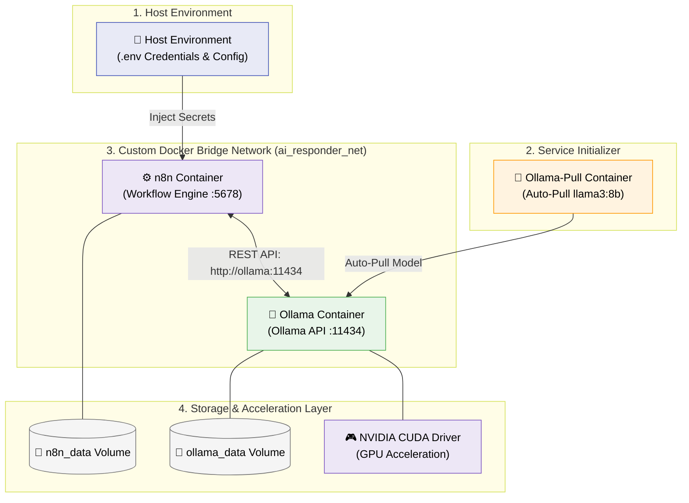

# 📧 Local AI Email Auto-Responder

> A fully local, privacy-first, on-device AI email auto-responder powered by **n8n** workflow automation, **Ollama** (`llama3:8b`), and **Docker Compose**. Designed for 100% data confidentiality, zero API cost, and automated email threading.

---

## 🌟 Key Features

- 🔒 **100% Local & Privacy-First**: Zero cloud dependencies or third-party LLM API calls. Your emails remain strictly on your device.
- ⚡ **GPU Accelerated Inference**: Powered by local Ollama container with CUDA GPU acceleration (NVIDIA RTX / WSL2 support).
- ⚙️ **Automated Workflow Orchestration**: Managed visually via n8n with automated environment variable credential injection (`CREDENTIALS_OVERWRITE_DATA`).
- 🛡️ **Smart Bot-Loop Prevention**: Built-in conditional logic filters out auto-replies to eliminate infinite mail loop storms.
- 🧵 **Dynamic Threading Preservation**: Preserves email conversation threads using `In-Reply-To`, `References`, and `Message-ID` headers.
- 🐳 **One-Command Docker Deployment**: Complete service lifecycle with healthchecks, persistent volumes, and auto-pull model initialization.

---

## 🏗️ System Architecture & Workflow Topology

### 1. High-Level Event Flow


---

### 2. Docker Container Infrastructure Topology



---

## 📁 Directory & File Structure

```text
localmail-ai/
├── docker-compose.yml     # Multi-container orchestration (n8n, ollama, ollama-pull)
├── workflow.json          # Exported n8n workflow definition (nodes, triggers, logic)
├── setup-model.sh         # Helper shell script for manual model initialization
├── verify_env.py          # Automated python test script for IMAP, SMTP, & Ollama
├── .env.example           # Template environment variable configuration
├── .env                   # Local active environment secrets (git-ignored)
├── submission.json        # Standard evaluation config schema
└── README.md              # System architecture and deployment documentation
```

---

## ⚡ Quick Start Guide

### 1. Prerequisites
- **Docker Desktop** installed with **WSL 2 backend** (Windows) or native Docker Engine (Linux).
- Email account with **IMAP & SMTP access enabled** (for Gmail, use an **App Password**).

---

### 2. Environment Configuration
Copy `.env.example` to create your active `.env` file:

```bash
cp .env.example .env
```

Update `.env` with your actual email credentials:

```ini
IMAP_HOST=imap.gmail.com
IMAP_PORT=993
IMAP_USER=your_email@gmail.com
IMAP_PASSWORD=your_gmail_app_password
IMAP_PASS=your_gmail_app_password

SMTP_HOST=smtp.gmail.com
SMTP_PORT=587
SMTP_USER=your_email@gmail.com
SMTP_PASSWORD=your_gmail_app_password
SMTP_PASS=your_gmail_app_password

WEBHOOK_URL=http://localhost:5678
N8N_PORT=5678
N8N_HOST=localhost
N8N_PROTOCOL=http
```

---

### 3. Launch Services
Start the containers in detached mode:

```bash
docker-compose up -d
```

Verify that containers are up and healthy:

```bash
docker-compose ps
```

---

### 4. Verify Local System Health
Run the automated python verification script to confirm **IMAP login**, **SMTP login**, and **Ollama LLM inference**:

```bash
python verify_env.py
```

Expected Output:
```text
--- Starting Verification ---
Testing IMAP connection to imap.gmail.com:993...
IMAP Login Successful!
Testing SMTP connection to smtp.gmail.com:587 (STARTTLS)...
SMTP Login Successful!
Testing local Ollama model (llama3:8b)...
Ollama Responded: Hi! It's nice to meet you! ...
--- Verification Complete ---
```

---

### 5. Import & Activate Workflow in n8n
1. Open your browser and navigate to **[http://localhost:5678](http://localhost:5678)**.
2. Complete the initial one-time owner account setup if prompted.
3. Click **Build a workflow** → Open top-right **`...` menu** → **Import from File**.
4. Select `workflow.json` from the repository root.
5. In the imported workflow:
   - Select **`IMAP account`** in the `EmailReadImap` node.
   - Select **`SMTP account`** in the `Send Email` node.
6. Toggle the **Active** switch in the top-right corner to **Green (`Active`)**.

---

## 🛠️ Deep Dive & Technical Highlights

### 1. Loop Prevention Logic
To prevent bot-to-bot mail loops, the `IF` node filters out emails where the subject line contains `"Re: AI Auto-Reply:"`. Valid user emails follow the **True** branch; automated replies route to **False** and halt execution.

### 2. Thread Preservation Headers
The `Send Email` node maps the original email's `messageId` to the reply's `In-Reply-To` and `References` headers, maintaining seamless conversation threads in mail clients like Gmail and Outlook.

### 3. Automated Credential Injection
`docker-compose.yml` uses `CREDENTIALS_OVERWRITE_DATA` to populate n8n credentials directly from `.env`, eliminating the need for manual credential typing in the UI.

---

## ⚠️ System Limitations & Potential Improvements

### Current Limitations
1. **Subject String Matching**: Loop prevention checks for `"Re: AI Auto-Reply:"` in the subject line. If an external user manually includes this prefix, their message will be dropped.
2. **Sequential Prompt Execution**: High concurrent email spikes can queue HTTP requests inside n8n sequential node executions.

### What Can Be Improved
- **Standard MIME Header Filtering**: Enhance the `IF` node to inspect standard headers such as `Auto-Submitted: auto-replied`, `X-Autoreply`, or `X-Auto-Response-Suppress`.
- **Asynchronous Task Queueing**: Deploy a message broker (e.g., Redis or RabbitMQ) to decouple email ingestion from Ollama LLM inference workers.

---

## 🔮 Future Scope & Roadmap

- **Retrieval-Augmented Generation (RAG)**: Integrate local vector database storage (Qdrant / ChromaDB) so the AI can pull context from internal company documentation and KB articles.
- **Sentiment & Intent Analysis**: Add multi-turn intent classification to automatically route negative sentiment or urgent emails to human support agents.
- **Multi-Language Support**: Enable automatic language detection and localized response generation.

---

## 📄 License
This project is open-source under the MIT License.
